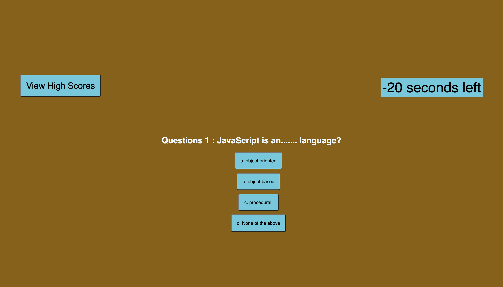

# Quiz-Game- Weekly Project 04

## Table of Contents

1. [About](#About)
2. [Languages Used](#languages-used)
3. [The Task](#the-task)
4. [Install](#install)
5. [Screenshots](#screenshots)
6. [Links](#links)

---

## About

The Quiz-game comprises multiple-choice questions, with the user presented with another question when they answer the previous one. However, if the user answers a question incorrectly, time is subtracted from the clock, adding an element of difficulty to the game.

The quiz ends when either all the questions are answered, or the timer reaches zero. At the end of the game, the user has the option to save their initials and score to track their progress over time.

---

## Languages Used

- Javascript
- CSS
- HTML

## The Task

### Acceptance Criteria

- GIVEN I am taking a code quiz
   
- WHEN I click the start button
   
- THEN a timer starts and I am presented with a question
   
- WHEN I answer a question
   
- THEN I am presented with another question
   
- WHEN I answer a question incorrectly
   
- THEN time is subtracted from the clock
   
- WHEN all questions are answered or the timer reaches 0
   
- THEN the game is over
   
  WHEN the game is over  

- THEN I can save my initials and score

## Install

- [Git](https://github.com/git-guides/install-git)
- [SSH Key](https://docs.github.com/en/authentication/connecting-to-github-with-ssh/adding-a-new-ssh-key-to-your-github-account)
- [Github Account](https://docs.github.com/en/get-started/onboarding/getting-started-with-your-github-account)
- [Google Chrome](https://support.google.com/chrome/answer/95346?hl=en&co=GENIE.Platform%3DDesktop)

## Screenshots:

## links

- [Github Repo](https://github.com/mdRashed30/Password-Generator--wk-03.git)
- [Deployed Page](https://mdrashed30.github.io/Quiz-Game-Challenege-4/)
